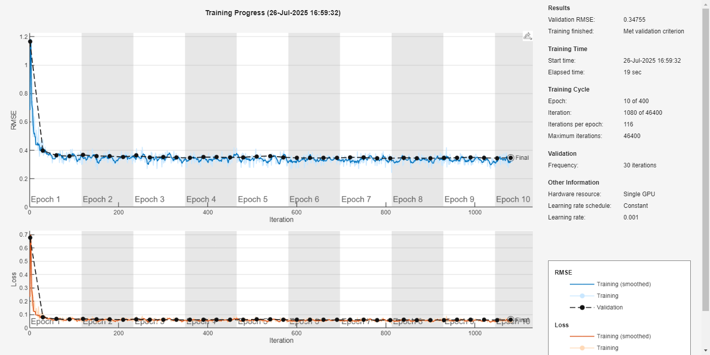

# T3Score

I was always inspired by Stockfish. So, I decided to create my own neural network that can **rate boards of Tic Tac Toe (TTT)** intelligently.

This project includes a trained regression-based neural network that evaluates the quality of a 3x3 TTT board and predicts a score from **0 (very bad position)** to **10 (winning position)**.

The dataset used in this model was from [this Kaggle dataset](https://www.kaggle.com/datasets/fabdelja/tictactoe/versions/1).


## Dataset and Training

Using a simple custom algorithm, I converted each game into a `3x3x3` input tensor (with channels for Player 1, Player 2, and empty spots) and a score label between 0 and 10.

Then I created a convolutional + dense model using **MATLAB's Deep Learning Toolbox**, and converted it to TensorFlow for broader usage.

### Model Architecture

The architecture consists of:

* `Conv2D (32 filters, 3x3, ReLU)`
* `BatchNormalization`
* `Conv2D (64 filters, 3x3, ReLU)`
* `BatchNormalization`
* `Reshape + Dense (128 units, ReLU)`
* `Dense (1 unit for regression output)`
* `Flatten` to get the final scalar output

### Training

Training was done using MATLAB, and the results were jolly good.

Training progress is shown below:



---

## Simple Usage

### 1. Load the model and predict a board's score:

```python
import numpy as np
from predict import predict_board_score

# Example board
board = np.array([
    [ 1,  0, -1],
    [ 0,  1,  0],
    [-1,  0,  1]
])

score = predict_board_score(board)
print(f"Predicted Score: {score:.2f}")
```

### 2. Board Format

* `1` for Player 1
* `-1` for Player 2
* `0` for empty cells
  This will be converted internally into a one-hot encoded 3x3x3 tensor.

## Copyright & License

You are **not allowed to sell this product**.
However, you **are allowed to use it**, experiment with it, or train your own custom dataset.

You **must give credit** to:

* Me (the creator of this network)
* [fabdelja](https://www.kaggle.com/fabdelja) on Kaggle for the dataset

Licensed under [CC BY-NC 4.0](https://creativecommons.org/licenses/by-nc/4.0/)